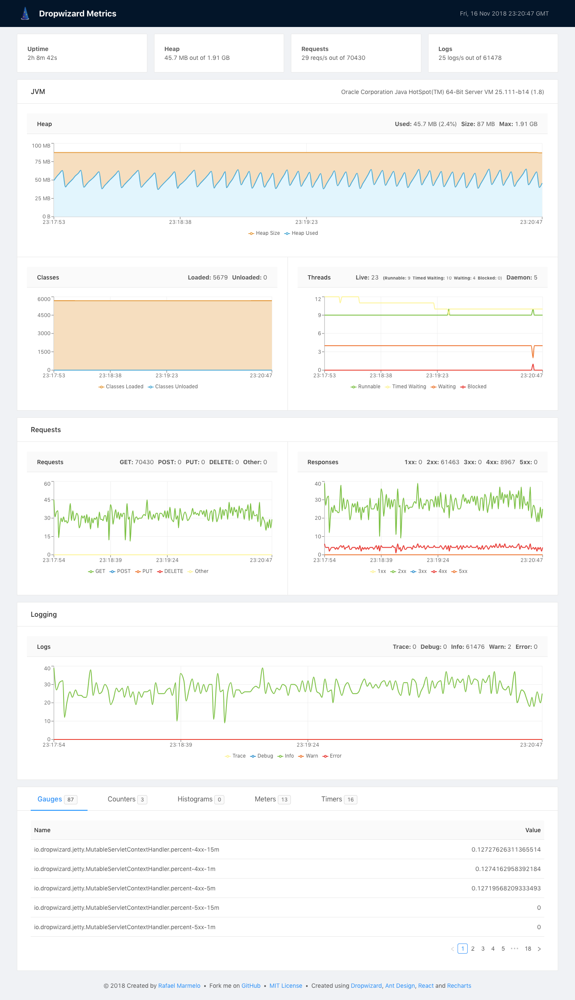

# Dropwizard Metrics UI

[](https://travis-ci.com/marmelo/dropwizard-metrics-ui)
[](https://maven-badges.herokuapp.com/maven-central/org.marmelo.dropwizard/dropwizard-metrics-ui)
[](https://github.com/marmelo/dropwizard-metrics-ui/blob/master/LICENSE)

**Dropwizard Metrics UI** is a [Dropwizard](https://www.dropwizard.io/) `Bundle` that exposes the registered [Dropwizard Metrics](https://metrics.dropwizard.io/) and displays its core metrics in a dashboard.




## Usage

Just add the following dependency to your `pom.xml`:

```xml
<dependency>
    <groupId>org.marmelo.dropwizard</groupId>
    <artifactId>dropwizard-metrics-ui</artifactId>
    <version>1.0</version>
</dependency>
```

And then register the `MetricsUIBundle` to your Dropwizard application inside the `Application#initialize` method:

```java
@Override
public void initialize(Bootstrap<HelloWorldConfiguration> bootstrap) {
    bootstrap.addBundle(new MetricsUIBundle());
}
```

By default it will be available through the administrative environment at [http://localhost:8081/admin/](http://localhost:8081/admin/).


## Advanced Usage

The Dropwizard Metrics UI leverages the already available Dropwizard Metrics REST endpoints and can only be deployed together in the same environment (usually the administrative environment).

You may override the default `/admin` path through the `MetricsUIBundle` constructor:

```java
@Override
public void initialize(Bootstrap<HelloWorldConfiguration> bootstrap) {
    bootstrap.addBundle(new MetricsUIBundle("/dashboard/*"));
}
```

If you want full customization power you may register the underlying `MetricsUIServlet` servlet manually:

```java
@Override
public void run(Environment environment) {
    environment.admin()
            .addServlet("Dropwizard Metrics UI", new MetricsUIServlet())
            .addMapping("/admin/*");
}
```


## Support

Please file bug reports and feature requests in [GitHub issues](https://github.com/marmelo/dropwizard-metrics-ui/issues).


## License

Copyright (c) 2018 Rafael Marmelo

This library is licensed under the [MIT License](LICENSE).
